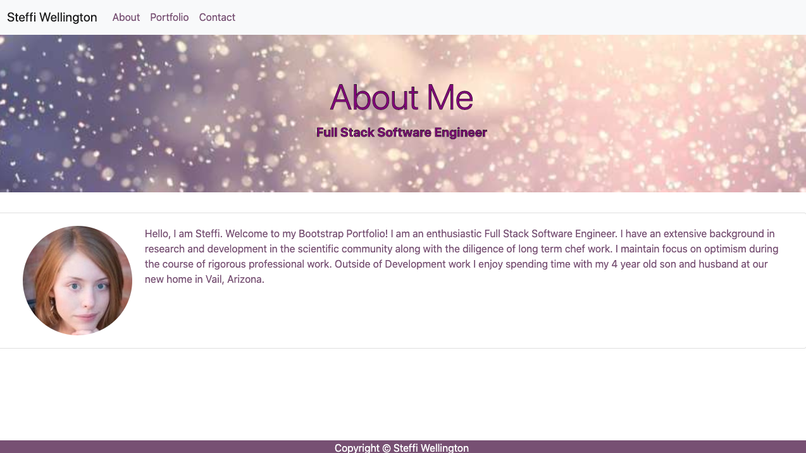

# Steffi Wellington Bootstrap-Portfolio
A Portfolio made with the illustrious Bootstrap.

### What is this?
The Art of HTML and Bootstrap.

### Who is it for?
Anyone looking to learn to build out a Portfolio with Bootstrap, this is a good practice problem. Build a Bootstrap Portfolio from scratch! Take a look at mine for inspiration! 

### How do I use this myself?
You can use this code yourself by first copying the code and using git clone in your terminal or your command prompt and then to see the finished product you can go ahead and open this code in Visual Studio code and right click on the index.html to open this in browser. Take a look at the Bootstrap Portfolio there and take a look at the code. The real challenge is when you close out of my code and try to recreate it yourself from scratch! You can do this!

 * Here is what the Bootrap Portfolio looks like and if you click the picture you can go straight to looking through the portfolio!

